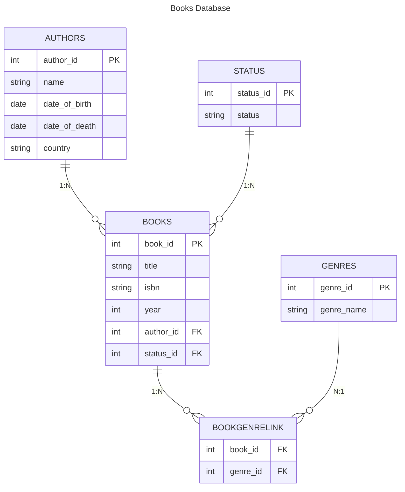

# Books database

Little exercise to get more familiar with relational databases and the related Python libraries.

## Database structure
The database will collect the books in my bookshelf and is made by these tables:

- **Books**
    | Book ID | Title | ISBN | Year |
    |---------|-------|------|------|

- **Authors**
    | Author ID | Name | Date of Birth | Date of Death | Country |
    |-----------|------|---------------|---------------|---------|

- **Genres**
    | Genre ID | Genre Name |
    |----------|------------|

- **Status**
    | Status ID | Status |
    |-----------|--------|

### Relationships

- Authors ──1:N──> Books      (one author has many books)
- Status  ──1:N──> Books      (one status applies to many books)
- Books   <─N:N─> Genres      (many books have many genres, via Book_Genres)

Schematically, we have:

