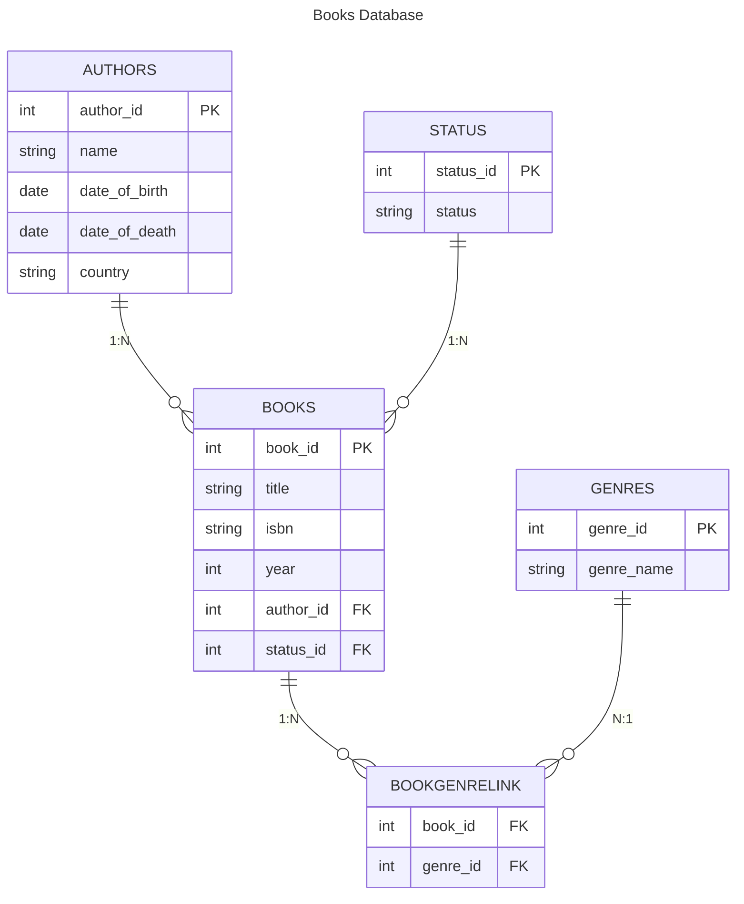

# Books database

Little exercise to get more familiar with relational databases and the related Python libraries.

## Database structure
The database will collect the books in my bookshelf and is made by these tables:

- **Books**
    | Book ID | Title | ISBN | Year |
    |---------|-------|------|------|

- **Authors**
    | Author ID | Name | Date of Birth | Date of Death | Country |
    |-----------|------|---------------|---------------|---------|

- **Genres**
    | Genre ID | Genre Name |
    |----------|------------|

- **Status**
    | Status ID | Status |
    |-----------|--------|

### Relationships

- Authors ──1:N──> Books      (one author has many books)
- Status  ──1:N──> Books      (one status applies to many books)
- Books   <─N:N─> Genres      (many books have many genres, via Book_Genres)

Schematically, we have:



## Frontend

There is a very small React + Vite frontend in the `frontend` folder that talks to the FastAPI backend.

- **Install dependencies** (run from the project root):

  ```bash
  cd frontend
  npm install
  ```

- **Run the backend** (from the project root, example with uv):

  ```bash
  uv run uvicorn src.api:app --reload
  ```

- **Run the frontend dev server**:

  ```bash
  cd frontend
  npm run dev
  ```

The frontend expects the API to be available at `http://localhost:8000` and uses these endpoints:

- `GET /genre/get/all` — fetch all genres
- `GET /author/get/all` — fetch all authors
- `GET /status/get/all` — fetch all statuses
- `GET /book/get/all` — fetch all books
- `POST /genre/create` with body `{ "name": string }` — create a genre
- `POST /author/create` with body `{ "name", "date_of_birth", "date_of_death", "country" }` — create an author
- `POST /book/create` with body `{ "title", "isbn", "year", "author_id", "status_id" }` — create a book
- `DELETE /genre/delete?genre_id={id}` — delete a genre
- `DELETE /author/delete?author_id={id}` — delete an author
- `DELETE /book/delete?book_id={id}` — delete a book

## Folder structure

```
book_database/
├── frontend/                   # React + Vite frontend
│   ├── src/
│   │   ├── App.tsx
│   │   └── main.tsx
│   ├── index.html
│   ├── package.json
│   ├── tsconfig.json
│   └── vite.config.ts
├── src/                        # FastAPI backend
│   ├── database/
│   │   ├── connection.py       # DB connection setup
│   │   ├── db.py               # DB session management
│   │   └── models.py           # SQLAlchemy models
│   ├── endpoints/
│   │   ├── author/
│   │   │   ├── add_author.py
│   │   │   ├── delete_author.py
│   │   │   ├── get_all_authors.py
│   │   │   ├── get_author.py
│   │   │   ├── update_author.py
│   │   │   ├── response.py
│   │   │   └── router.py
│   │   ├── book/
│   │   │   ├── add_book.py
│   │   │   ├── delete_book.py
│   │   │   ├── get_all_books.py
│   │   │   ├── get_book.py
│   │   │   ├── update_book.py
│   │   │   ├── response.py
│   │   │   └── router.py
│   │   ├── genre/
│   │   │   ├── add_genre.py
│   │   │   ├── delete_genre.py
│   │   │   ├── get_all_genres.py
│   │   │   ├── get_genre.py
│   │   │   ├── update_genre.py
│   │   │   ├── response.py
│   │   │   └── router.py
│   │   └── status/
│   │       ├── add_status.py
│   │       ├── delete_status.py
│   │       ├── get_all_statuses.py
│   │       ├── get_status.py
│   │       ├── update_status.py
│   │       ├── response.py
│   │       └── router.py
│   ├── repositories/
│   │   ├── authors_repo.py
│   │   ├── books_repo.py
│   │   ├── genres_repo.py
│   │   └── statuses_repo.py
│   ├── schemas/
│   │   ├── __init__.py
│   │   ├── author_schemas.py
│   │   ├── book_schemas.py
│   │   ├── genre_schemas.py
│   │   └── status_schemas.py
│   ├── services/
│   │   ├── authors_service.py
│   │   ├── books_service.py
│   │   ├── genres_service.py
│   │   └── statuses_service.py
│   ├── utils/
│   │   └── fake_entries.py
│   ├── api.py                  # FastAPI app entry point
│   └── main.py
├── .env.example
├── Justfile
├── pyproject.toml
├── requirements.txt
└── README.md
```
